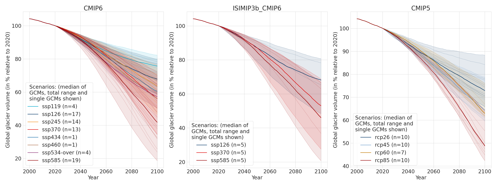
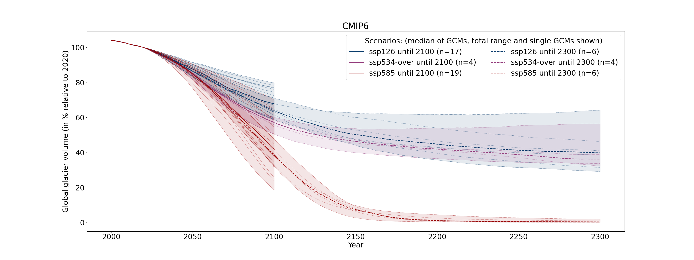
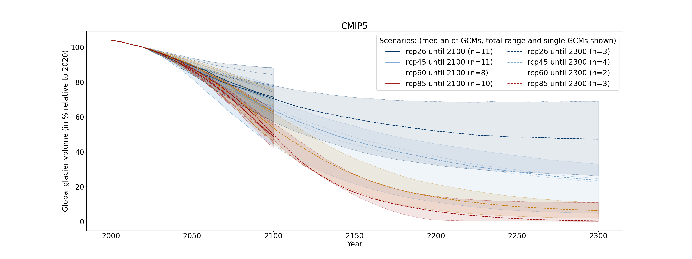

# OGGM global glacier projections

Since OGGM v1.6.1, each version of OGGM now provides a set of global glacier
projections realized with the default set-up of OGGM for that version.
We provide an OGGM simulation for all climate models we are aware of and have
access to.

This README file contains the description of the aggregated data. This description includes the experimental set-up, 
a brief comparison of our projections to [Rounce et al. (2023)](https://doi.org/10.1126/science.abo1324) and information 
on the data structure.

If you want `per-glacier` files, or other estimates than volume or area (e.g. the four components to compute glacier runoff, or the volume above sea-level), 
the non-aggregated raw netcdf oggm output files are available [here](https://cluster.klima.uni-bremen.de/~oggm/oggm-standard-projections). 
These files are further documented in [README_extended_per_glacier_files.md](README_extended_per_glacier_files.md), where it is also 
explained how to rerun the projections. 
The aggregation from the raw files to the csv files was done via [notebooks/aggregate_csv_files_1.6.1.ipynb](notebooks/aggregate_csv_files_1.6.1.ipynb). 

----

If you use these data (either aggregated csv or the per-glacier netcdf files), please cite the dataset as following:

- Cite ZENODO
- Cite OGGM (Maussion et al., 2019) and the specific OGGM version as specified in the [OGGM documentation](https://docs.oggm.org/en/stable/citing-oggm.html)

In addition, we recommend to refer to the CMIP option that you are using (references are linked below).

---

**Repository of data files and documentation of the standard (CMIP) projections computed with OGGM**

***Experimental set-up***

At the moment, there are only projections available using OGGM v1.6.1 (folder: [1.6.1/](1.6.1/])) with the [preprocessed glacier directory version 2023.3](https://cluster.klima.uni-bremen.de/~oggm/gdirs/oggm_v1.6/L3-L5_files/2023.3/elev_bands/W5E5_spinup/). These projections use  [elevation-band flowlines](https://docs.oggm.org/en/stable/flowlines.html#elevation-bands-flowlines), include the [dynamical spinup](https://docs.oggm.org/en/latest/dynamic-spinup.html), the [new informed 3-step per-glacier geodetic calibration method](https://docs.oggm.org/en/latest/mass-balance-monthly.html), use the W5E5v2.0 climate dataset [(Lange and others, 2021)](https://doi.org/10.48364/ISIMIP.342217) for calibration. The regional glacier volume matches roughly the [Farinotti et al. (2019)](https://doi.org/10.1038/s41561-019-0300-3) consensus estimate by calibrating the glen-A parameter regionally. 

||
|:--:| 
| *Figure 1: Global glacier volume from 2000 to 2100 relative to 2020 (in %) for the different CMIP options using the common running glaciers until 2100. The amount of GCMs per scenario is given in the legend.* |
||
| *Figure 2: : Global glacier volume from 2000 to 2300 relative to 2020 (in %) only for CMIP6 by using the common running glaciers until 2100 and 2300. The amount of GCMs per scenario is given in the legend. Note that the smaller GCM ensemble until 2300 is rather "hotter" than the more representative ensemble until 2100.* |
||
| *Figure 3: : Global glacier volume from 2000 to 2300 relative to 2020 (in %) only for CMIP5 by using the common running glaciers until 2100 and 2300. The amount of GCMs per scenario is given in the legend.* |

***Simulation comparison***

In comparison to [Rounce et al. (2023)](https://doi.org/10.1126/science.abo1324), OGGM v1.6.1 creates globally more relative glacier volume loss, specifically for very warm scenarios and for RGI region 19 (Antarctic and Subantarctic). [The differences in the glacier volume loss relative to 2020 are 10% under SSP5-8.5](notebooks/global_glacier_volume_comparison_to_rounce_et_al_2023_ssp585.png). Globally, the glacier volume is 12% (20-30%) larger at the initial state. The code to create the figures above and additional regional analysis are here [notebooks/analyse_csv_files_1.6.1.ipynb](notebooks/analyse_csv_files_1.6.1.ipynb), additional comparisons to [Rounce et al. (2023)](https://doi.org/10.1126/science.abo1324) are here: [notebooks/compare_oggm_1.6.1_to_rounce_et_al_2023.ipynb](notebooks/compare_oggm_1.6.1_to_rounce_et_al_2023.ipynb).

We computed and show in the figures all GCMs and scenarios that are currently available at the OGGM cluster. However, you might have to make a selection of those scenarios that are suitable and representative for your case. [For example, you could select them after the method of Hausfather et al. (2022)](https://www.nature.com/articles/d41586-022-01192-2) or [aggregate them after their 2100 warming levels (e.g. as in Rounce et al., 2023)](https://doi.org/10.1126/science.abo1324).

***Avaibable glacier aggregation options*** 

We only did the sum over those glaciers that do not [fail](https://docs.oggm.org/en/latest/faq.html#some-glaciers-exit-with-errors-what-should-i-do) for any of the scenarios, GCMs and CMIP variations. The data is not corrected for missing glaciers (this is something you could do yourself by for instance upscaling the results). A summary plot of the missing glacier area and missing glacier amount is in [notebooks/missing_glacier_area_stats.png](notebooks/missing_glacier_area_stats.png). As more glaciers fail when running the simulations until 2300, we separated between 
- files with aggregated glaciers that run for all options until 2100 (`common_running_2100`)
    - use these files if you are only interested in glacier projections until 2100
    - Globally, 99.9% of the glacier area is simulated when looking into the common running glaciers until 2100. 
- files with aggregated glaciers that run for all options until 2100 and until 2300 (`common_running_2100_2300`). 
    - use these files if you are interested in glacier projections until 2300
    - The simulations until 2300 have more failing glaciers, specifically in RGI region 6 (Iceland) where only 26% of glaciers run succesfully for all GCM's and scenarios until 2300. The reason is that some single GCMs predict colder than nowadays conditions, which creates growing glaciers that extend beyond pre-defined model domain (for which a border value of 160 has been used). However, these glaciers are rather small, and in total 91% of the initial glacier area can be simulated in RGI region 6. Similarly, in RGI region 8 (Scandinavia), 92% of the initial glacier area is being accounted for due to growing glaciers. Globally, 99.4% of the initial glacier area is simulated when looking into the common running glaciers until 2100 or 2300. 

For each of the two options, we give additional statistics:
- e.g. [1.6.1/common_running_2100/missing_region_overview.csv](1.6.1/common_running_2100/missing_region_overview.csv): missing glacier statistics
- e.g. [1.6.1/common_running_2100_2300/rgi_ids_missing.json](1.6.1/common_running_2100_2300/rgi_ids_missing.json): glacier IDs that have been removed as at least one GCM or scenario failed on it for one of the CMIP options
- e.g. [1.6.1/common_running_2100/metadata.csv](1.6.1/common_running_2100/metadata.csv): can be helpful when doing analysis with the data (lists all the available files)

***Data units***
- volume is given in m3
- area is given in m2

***CMIP option and final year:***
At the moment there are three options here. For all options, W5E5 was applied from 2000-2019 and the GCMs were applied from 2020 onwards until 2100 or 2300. Note that the sample of GCMs going until 2300 is much smaller than the one going until 2100. ISIMIP3b_CMIP6 only goes until 2100, thus projections only go until 2100. 

- CMIP6/2100 or CMIP6/2300
    - bias correction period 2000-2019
    - main reference: [Eyring et al. (2016)](https://doi.org/10.5194/gmd-9-1937-2016)
- CMIP5/2100 or CMIP5/2300
    - bias correction period 2000-2019
    - main reference [Taylor et al., (2012)](https://doi.org/10.1175/BAMS-D-11-00094.1)
- ISIMIP3b_CMIP6/2100
    - internally bias-corrected to W5E5 using bias correction period 1979-2014 [(Lange, 2019)](https://doi.org/10.5194/gmd-12-3055-2019) and interpolated to a 0.5° spatial resolution, we did not apply any additional bias-correction on top of that
    - five primary GCMs from phase 3b of the Inter-Sectoral Impact Model Intercomparison Project (ISIMIP3b) for three different SSPs
    - main references ([Lange, 2019](https://doi.org/10.5194/gmd-12-3055-2019); [Lange, 2022](https://doi.org/10.5281/zenodo.2549631))
    
(in the raw per-glacier data files, you can also find the same simulations using the GCMs from 2000 onwards, named `gcm_from_2000` -> more in [README_extended_per_glacier_files.md](README_extended_per_glacier_files.md))

The actual projections for the different scenarios are given in `{scenario}.csv` files in subfolders for every RGI region or globally. In every file, all GCM projections from one scenario (e.g. `ssp370.csv`) are given as different columns, where each of the rows shows one time point.

***File structure***:
The file structure looks e.g. like that:
- [1.6.1/common_running_2100/volume/CMIP5/2100/RGI01/rcp85.csv](1.6.1/common_running_2100/volume/CMIP5/2100/RGI01/rcp85.csv)
- [1.6.1/common_running_2100_2300/volume/CMIP6/2300/global/ssp126.csv](1.6.1/common_running_2100_2300/volume/CMIP6/2300/global/ssp126.csv)
